<!-- ===================== HEADER WAVE ===================== -->
<div align="center">
    
</div>
<!-- ===================== TYPING ANIMATION ===================== -->
<p align="center">
    <a href="https://github.com/DenverCoder1/readme-typing-svg">
        
    </a>
</p>
<!-- ===================== ANIMATED GREETING ===================== -->
<h1 align="center">
    
    Welcome to My Digital Workspace
    
</h1>
<!-- ===================== PROFILE BADGES ===================== -->
<p align="center">
    
    
    
    
</p>
<!-- ===================== SOCIAL MEDIA ===================== -->
<h2 align="center">
    <span style="color:#00C2FF;">📬 Contact</span> 
    <span style="color:#7E3ACE;">Me 💬</span>
</h2>
<p align="center">
    <a href="https://www.linkedin.com/in/yassin-chihaoui-a3a7792a1" target="_blank">
        
    </a>
    <a href="https://www.instagram.com/yassin__chihaoui_/?igsh=bDRhdjkyb2VqdGE%3D#" target="_blank">
        
    </a>
    <a href="mailto:rotchildyassin@gmail.com">
        
    </a>
    <a href="https://www.facebook.com/yassin.chihaoui.31?rdid=jAP0EslCFSUnxwAW&share_url=https%3A%2F%2Fwww.facebook.com%2Fshare%2F16czZ2qc4A%2F#" target="_blank">
    
    <a href="https://wa.me/21628289045" target="_blank" rel="noopener noreferrer" style="text-decoration: none;">
    
</a>
      <a href="tel:+21621164245" style="text-decoration: none;">
    
</a>
</a>

</p>
<br/>
<!-- ===================== ANIMATED SEPARATOR ===================== -->

<br/>
<!-- ===================== ABOUT ME SECTION ===================== -->
<div align="center">
    
</div>
<h2 align="center">
     
    About Me
</h2>
```typescript
<div style="
    max-width: 520px;
    margin: 30px auto;
    padding: 25px;
    border-radius: 18px;
    background: linear-gradient(135deg, #0f2027, #203a43, #2c5364);
    box-shadow: 0 15px 40px rgba(0,0,0,0.5);
    font-family: 'Segoe UI', Tahoma, Geneva, Verdana, sans-serif;
    color: #ffffff;
">

<h2 style="text-align:center; margin-bottom:10px;">
    👨‍💻 Yassin Chihaoui
</h2>

<p style="text-align:center; color:#00C2FF; margin-bottom:20px;">
    Full Stack Web Developer • Tunis 🇹🇳
</p>

<pre style="
    background: rgba(0,0,0,0.35);
    padding: 18px;
    border-radius: 12px;
    overflow-x: auto;
    font-size: 14px;
    line-height: 1.6;
    color: #E6F1FF;
">
const yassin = {
  name: "Yassin Chihaoui",
  role: "Full Stack Web Developer",
  location: "Tunis, Tunisia 🇹🇳",
  experience: "6+ Years",

  code: ["JavaScript", "TypeScript", "PHP", "HTML5", "CSS3", "SQL"],

  technologies: {
    frontend: {
      frameworks: ["React", "Vue.js", "Next.js", "Nuxt.js"],
      styling: ["TailwindCSS", "Bootstrap", "Sass", "Material-UI"],
      state: ["Redux", "Vuex", "Context API", "Pinia"]
    },
    backend: {
      runtime: ["Node.js", "Express.js"],
      databases: ["MongoDB", "PostgreSQL", "MySQL", "Firebase"],
      api: ["REST", "GraphQL", "WebSocket"]
    },
    devOps: ["Docker", "Git", "GitHub Actions", "Vercel", "Netlify"],
    tools: ["VS Code", "Postman", "Figma", "Jira"]
  },

  architecture: ["Microservices", "MVC", "RESTful", "Event-Driven"],

  currentFocus: "Building scalable, performant web applications",
  funFact: "I debug with console.log and I'm not ashamed! 😄"
};
</pre>

<p style="text-align:center; margin-top:15px; color:#9BE7FF;">
🚀 Clean Code • Scalable Systems • Modern Web
</p>

</div>

<br/>

<!-- ===================== WHAT I DO ===================== -->
<h2 align="center">🎯 What I Do</h2>

<table align="center">
<tr>
<td width="50%" valign="top">

### 🎨 Frontend Development
- ⚡ Building responsive, modern UIs
- 🎭 Creating seamless user experiences
- 📱 Mobile-first design approach
- ♿ Accessibility-focused development
- 🌈 Pixel-perfect implementations

</td>
<td width="50%" valign="top">

### ⚙️ Backend Development
- 🔧 RESTful API design & development
- 🗄️ Database architecture & optimization
- 🔐 Authentication & authorization systems
- 📊 Data modeling & management
- 🚀 Server-side performance optimization

</td>
</tr>
</table>

<br/>

<!-- ===================== TECHNICAL SKILLS ===================== -->


<h2 align="center">🛠️ Technical Arsenal</h2>

### 💻 Languages & Markup
<p align="center">
    <a href="#"></a>
    <a href="#"></a>
    <a href="#"></a>
    <a href="#"></a>
    <a href="#"></a>
    <a href="#"></a>
</p>

### 🎨 Frontend Technologies
<p align="center">
    <a href="#"></a>
    <a href="#"></a>
    <a href="#"></a>
    <a href="#"></a>
    <a href="#"></a>
    <a href="#"></a>
    <a href="#"></a>
    <a href="#"></a>
</p>

### ⚙️ Backend Technologies
<p align="center">
    <a href="#"></a>
    <a href="#"></a>
    <a href="#"></a>
    <a href="#"></a>
</p>

### 🗄️ Databases & Cloud
<p align="center">
    <a href="#"></a>
    <a href="#"></a>
    <a href="#"></a>
    <a href="#"></a>
    <a href="#"></a>
</p>

### 🔧 Tools & Platforms
<p align="center">
    <a href="#"></a>
    <a href="#"></a>
    <a href="#"></a>
    <a href="#"></a>
    <a href="#"></a>
    <a href="#"></a>
    <a href="#"></a>
    <a href="#"></a>
</p>

<br/>

<!-- ===================== EXPERTISE AREAS ===================== -->

<br />
<div align="center">
    
</div>


<h2 align="center">🎓 Core Competencies</h2>

<div align="center">

| 💡 **Expertise Area** | 📊 **Proficiency** | 🎯 **Focus** |
|:---------------------|:------------------|:------------|
| Frontend Development | ⭐⭐⭐⭐⭐ | React, Vue, Next.js |
| Backend Development | ⭐⭐⭐⭐⭐ | Node.js, Express, APIs |
| Database Design | ⭐⭐⭐⭐⭐ | SQL & NoSQL |
| UI/UX Implementation | ⭐⭐⭐⭐⭐ | Responsive Design |
| API Development | ⭐⭐⭐⭐⭐ | REST & GraphQL |
| DevOps & Deployment | ⭐⭐⭐⭐ | Docker, CI/CD |
| State Management | ⭐⭐⭐⭐⭐ | Redux, Vuex, Context |
| Testing & Quality | ⭐⭐⭐⭐ | Jest, Testing Library |

</div>

<br/>

<!-- ===================== FEATURED PROJECTS ===================== -->


<h2 align="center">🚀 Featured Projects</h2>

<div align="center">

### 🛒 E-Commerce Platform
**Tech Stack:** React • Node.js • MongoDB • Stripe • Redux • TailwindCSS

> A full-featured online shopping platform with real-time inventory, secure payments, user authentication, and admin dashboard. Features include product search, cart management, order tracking, and email notifications.

**Key Features:** 💳 Secure Payments • 📦 Order Management • 🔐 JWT Auth • 📊 Admin Analytics

---

### 💬 Real-Time Chat Application
**Tech Stack:** Socket.io • Node.js • React • MongoDB • Redis

> WebSocket-based messaging app with rooms, private messages, typing indicators, read receipts, and file sharing. Supports emoji reactions and message history.

**Key Features:** ⚡ Instant Messaging • 👥 Group Chats • 📎 File Sharing • 🔔 Push Notifications

---

### 📝 Content Management System
**Tech Stack:** Vue.js • Nuxt.js • PostgreSQL • Express • GraphQL

> Modern CMS with drag-and-drop editor, media library, SEO optimization, and multi-language support. Features role-based access control and scheduled publishing.

**Key Features:** ✍️ WYSIWYG Editor • 🌐 Multi-language • 🔍 SEO Tools • 👤 User Roles

---

### 📊 Business Analytics Dashboard
**Tech Stack:** React • Chart.js • Node.js • PostgreSQL • Material-UI

> Comprehensive analytics platform with real-time data visualization, customizable widgets, report generation, and export capabilities. Integrates with multiple data sources.

**Key Features:** 📈 Data Visualization • 📑 Report Generator • 🎨 Custom Widgets • 📥 Export Tools

---

### 🌐 Portfolio & Blog Platform
**Tech Stack:** Next.js • TailwindCSS • MDX • Vercel • Prisma

> JAMstack portfolio site with integrated blog, project showcase, contact form, and dark mode. Optimized for SEO and performance with static generation.

**Key Features:** ⚡ Lightning Fast • 🎨 Modern Design • 📱 Fully Responsive • 🌙 Dark Mode

</div>

<br/>

<!-- ===================== DEVELOPMENT PHILOSOPHY ===================== -->


<h2 align="center">💭 Development Philosophy</h2>

<div align="center">
    
</div>

<table align="center">
<tr>
<td width="33%" valign="top" align="center">

### 🧹 Clean Code
**The Boy Scout Rule**

Always leave code better than you found it. Focus on readability, maintainability, and scalability in every commit.

</td>
<td width="33%" valign="top" align="center">

### 🎯 User-Centric
**Experience First**

Every line of code serves the end user. Performance, accessibility, and intuitive design are non-negotiable.

</td>
<td width="33%" valign="top" align="center">

### 🔄 Continuous Learning
**Stay Current**

Web development evolves rapidly. I dedicate time to learning new tools, frameworks, and best practices.

</td>
</tr>
</table>

<br/>

### 🌟 My Core Values
```javascript
const coreValues = {
    quality: "Write code that you'd be proud to maintain",
    collaboration: "Great software is built by great teams",
    innovation: "Push boundaries while respecting fundamentals",
    documentation: "Code is read more than it's written",
    testing: "Confidence comes from comprehensive tests",
    openSource: "Give back to the community that gives to us"
};
<br/>
<!-- ===================== GITHUB STATISTICS ===================== -->

<h2 align="center">📊 GitHub Analytics</h2>
<p align="center">
    
    
</p>
<p align="center">
    
</p>
<p align="center">
    
</p>
<br/>
<!-- ===================== CONTRIBUTION GRAPH ===================== -->
<h3 align="center">📈 Contribution Graph</h3>
<p align="center">
    
</p>
<br/>
<!-- ===================== CURRENT FOCUS ===================== -->

<h2 align="center">🎯 Current Focus & Learning</h2>
<div align="center">
🌱 Currently Exploring
🔹 Advanced React Patterns - Server Components, Suspense, Concurrent Features
🔹 Web Performance - Core Web Vitals optimization & bundle size reduction
🔹 System Design - Scalable architecture patterns for large applications
🔹 AI Integration - Implementing AI features in modern web apps
🔹 Cloud Native - Kubernetes, microservices, and serverless architectures
📚 Reading & Resources

📖 Clean Architecture by Robert C. Martin
📖 Designing Data-Intensive Applications
📖 Web Performance in Action
🎓 Advanced TypeScript patterns
🎓 GraphQL best practices

</div>
<br/>
<!-- ===================== OPEN SOURCE ===================== -->

<h2 align="center">🤝 Open Source Contributions</h2>
<div align="center">
    
</div>
<p align="center">
    <i>"Open source isn't just about code—it's about community, collaboration, and collective growth."</i>
</p>
🌟 My Contribution Philosophy

🐛 Bug Fixes: When I encounter issues, I contribute solutions back
📚 Documentation: Improving docs to help newcomers get started faster
💡 Feature Suggestions: Proposing enhancements that benefit the community
🔍 Code Reviews: Participating in discussions to maintain code quality
🎓 Mentoring: Helping new developers through issues and pull requests

```mermaid
graph LR
    A[📋 Requirements] --> B[🎨 Design]
    B --> C[⚙️ Architecture]
    C --> D[💻 Development]
    D --> E[🧪 Testing]
    E --> F[📦 Deployment]
    F --> G[📊 Monitor]
    G --> H[🔄 Iterate]
    H --> A
```

<br/>
<!-- ===================== WORK APPROACH ===================== -->

<h2 align="center">⚡ My Development Workflow</h2>

🛠️ Best Practices I Follow
<table align="center">
<tr>
<td width="50%">
Code Quality
✅ Write self-documenting code
✅ Follow SOLID principles
✅ Maintain consistent style
✅ Use meaningful variable names
✅ Keep functions small & focused
</td>
<td width="50%">
Project Management
✅ Version control with Git
✅ Meaningful commit messages
✅ Code reviews before merge
✅ Continuous integration
✅ Comprehensive documentation
</td>
</tr>
</table>
<br/>
<!-- ===================== TESTIMONIALS ===================== -->

<h2 align="center">💬 What Drives Me</h2>
<div align="center">

"The best way to predict the future is to implement it."
— David Heinemeier Hansson


"Code is like humor. When you have to explain it, it's bad."
— Cory House


"First, solve the problem. Then, write the code."
— John Johnson

</div>
<br/>
<!-- ===================== CONNECT & COLLABORATE ===================== -->

<h2 align="center">🤝 Let's Build Something Amazing Together</h2>
<p align="center">
    
</p>
<div align="center">
📫 How to Reach Me
I'm always open to interesting conversations and collaboration opportunities! <br />
<a href="https://www.linkedin.com/in/yassin-chihaoui-a3a7792a1/?utm_source=share&utm_campaign=share_via&utm_content=profile&utm_medium=android_app">
    
</a>
<a href="mailto:rotchildyassin@gmail.com">
    
</a>
<a href="https://yassinchihaoui.dev">
    
</a> <br />
💼 Open for Opportunities
🔹 Full-time positions
🔹 Freelance projects
🔹 Collaborative ventures
🔹 Open source contributions
  <br />
🔹 Technical consulting
</div>
<br/>
<!-- ===================== GUEST BOOK ===================== -->

<h2 align="center">✍️ Leave Your Mark</h2>
<p align="center">
    Passing by? I'd love to hear from you!  
    <a href="https://github.com/yassinchihaoui/yassinchihaoui/issues/new?template=guestbook-entry.md">
        
    </a>
</p>
<br/>
<!-- ===================== RANDOM DEV JOKE ===================== -->

<h2 align="center">😄 Dev Humor</h2>
<p align="center">
    
</p>
<br/>
<!-- ===================== SUPPORT ===================== -->

<h2 align="center">☕ Support My Work</h2>
<p align="center">
    If you find my projects helpful or appreciate my contributions to open source,  
    consider buying me a coffee! It helps me stay caffeinated while coding 😊
</p>
<p align="center">
    <a href="https://www.buymeacoffee.com/yassinchihaoui">
        
    </a>
</p>
<br/>
<!-- ===================== CLOSING ===================== -->
<div align="center">
    
</div>
<br/>
<!-- ===================== BACK TO TOP ===================== -->
<p align="right">
    <a href="#top">
        
    </a>
</p>
<!-- ===================== FOOTER WAVE ===================== -->
<div align="center">
    
</div>

<div align="center">
    <sub>Built with ❤️ by Yassin Chihaoui</sub>
    <br/>
    <sub>© 2024 • Crafted with passion for web development</sub>
</div>
